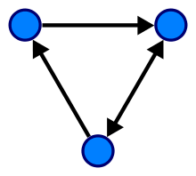
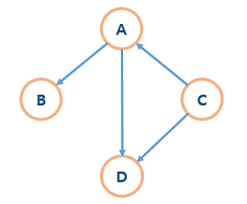
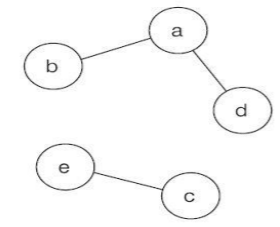
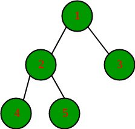
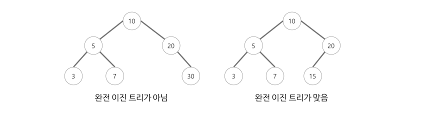
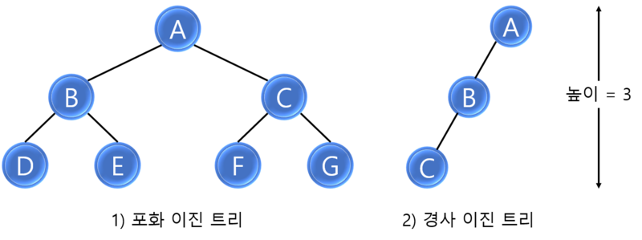

# 트리
 

트리는 계층형 트리 구조를 시뮬레이션 하는 추상 자료형(ADT)으로, 루트 값과 부모 - 자식 관계의 서브트리로 구성되며, 서로 연결된 노드의 집합이다.

트리는 재귀로 정의된 자기 참조 자료구조이다.
 
 

## 트리의 각 명칭
  
- ### 루트 노드 (root node) : 부모가 없는 노드, 트리는 하나의 부모 노드만을 가진다.

- ### 단말 노드 (leaf node) : 자식이 없는 노드

- ### 내부 노드 (internal node) : 단말 노드가 아닌 노드

- ### 간선 (edge) : 노드를 연결하는 선

- ### 크기 (Size) : 자신을 포함한 모든 자식 노드의 개수

- ### 깊이 (depth) : 루트에서 어떤 노드에 도달하기 위해 거쳐야 하는 간선의 수 

- ### 레벨 (level) : 특정 깊이를 가지는 노드의 집합, 0부터 시작하는 것이 일반적이다.

- ### 차수 (degree) : 각 노드가 지닌 간선의 수

 
 

## 그래프 VS 트리
 

### <u>**트리는 순환 구조를 가지지 않는 그래프이다.</u>**

 
트리는 특수한 형태의 그래프의 일종이며, 그래프의 범주에 포함된다. 하지만 트리는 그래프와 달리 어떠한 경우에도 한번 연결된 노드가 다시 연결되는 법이 없다. <u>(순환 구조를 가지지 않음.)</u> 

 
 
단방향, 양방향을 모두 가리킬 수 있는 그래프와 달리, 트리는 부모 노드에서 자식 노드를 가리키는 단방향뿐이다.

 
 

### **트리가 아닌 예**
 

1 )

 
 

그림 1)은 순환 구조를 갖지 않아야 한다는 트리의 정의에 부합하지 않으므로 트리가 아니다.
 
 
 

2 )

 
 

그림 2) 에서 D의 부모 노드는 A와 C로, 2개이므로 트리가 아니다. 트리의 부모 노드는 단 하나여야 한다.
 
 
 

3 )

 
 

그림 3) 에서 루트가 둘이므로 트리가 아니다. 트리의 루트 또한 하나여야 한다. 
 
 
 

## 이진 트리
 

<u>각 노드가</u> n개 이하의 자식을 갖고 있으면 n-ary 트리라고 한다. 여기서 n = 2일 경우, 즉 모든 노드의 차수가 2 이하일 때는 특별히 **이진 트리**라고 구분해서 부른다.

 

  ### -이진 트리의 유형
   

### 정 이진 트리 (Full Binary Tree) : 모든 노드가 0개 또는 2개의 자식 노드를 갖는다.
 

---------------------------------------------------------------
 
 

### 완전 이진 트리 (Complete Binary Tree) : 마지막 레벨을 제외하고 모든 레벨이 완전히 채워져 있으며, 마지막 레벨의 모든 노드는 가장 왼쪽부터 채워져 있다
 

----------------------------------------------------------------
 
 

### 포화 이진 트리 (Perfect Binary Tree) : 모든 노드가 2개의 자식 노드를 가지고 있으며 모든 단말 노드 (leaf node)가 동일한 깊이 또는 레벨을 갖는다. 문자 그대로, 가장 완벽한 유형의 트리다.

  